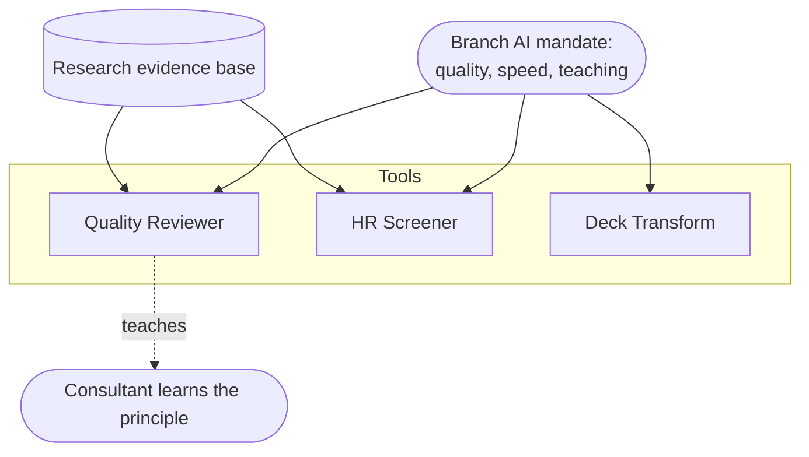
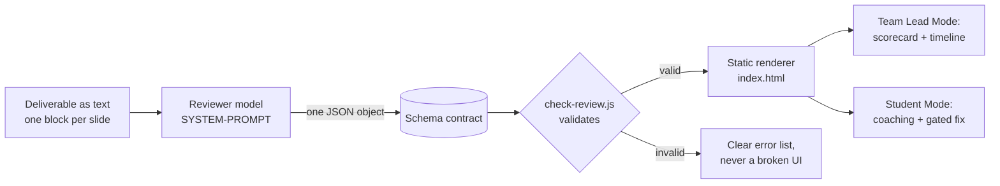
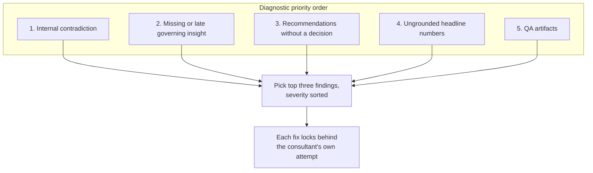

# Architecture

How the pieces fit, and the one design pattern they share.

## System map

## The shared pattern: a deterministic contract

Every tool keeps the model smart and the renderer dumb. The model returns one structured object. A static template owns every pixel. They only meet through a schema, so the output is auditable and stable run to run.

## Quality Reviewer in detail

The five criteria, scored as binary checks, in diagnostic priority order:

Score per criterion = 1 + 4 times checksPassed / checksTotal. Overall is the mean to one decimal. Verdict is Needs revision if any criterion fails, Minor revision if all pass or partial with at least one partial, Ready only if all pass.

## Where the diagrams live

This repo uses Mermaid in markdown so diagrams render directly on GitHub, version with the code and stay editable in plain text. The brainstorming map in [../ideas/idea-map.md](../ideas/idea-map.md) uses the same approach.
