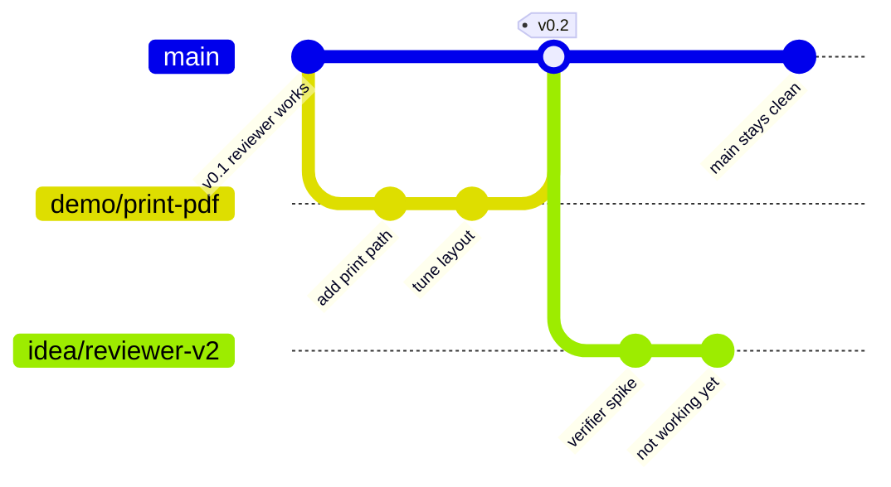

# How we work: branches, versions and pushes

One rule holds everything together: **`main` always works.** It is the version you can open, demo or push to production at any moment without checking first. Everything else happens on a branch, so a bad experiment can never touch the working thing.

## The picture

`main` runs along the bottom and never breaks. Branches go off to the side. When a branch is good, it merges back and we tag a version. When a branch is bad (the `idea/reviewer-v2` spike above), we just delete it and `main` never noticed.

## Branch types

Name a branch by what it is, then a short slug:

| Prefix | For | Example |
|---|---|---|
| `feature/` | a real addition headed for main | `feature/verifier-pass` |
| `demo/` | a version to show, not necessarily to keep | `demo/board-pitch` |
| `fix/` | correcting something | `fix/tile-state` |
| `idea/` | an experiment that may go nowhere | `idea/intake-assistant` |

A branch maps to an idea card in [../ideas/backlog.md](../ideas/backlog.md). Same slug where you can. That is the link between "what we are thinking" and "what we are building".

## The loop

1. **Branch** off `main`: `git checkout -b feature/<slug>`.
2. **Build and test** on the branch. Break whatever you want here.
3. **Open a pull request** when it works. The PR description is where the push is documented: what changed and why, linked to the idea card.
4. **Merge** into `main` once it passes. Then **tag a version** if it is a milestone: `git tag v0.3 && git push --tags`.
5. **Update** the idea card stage and add a line to [../CHANGELOG.md](../CHANGELOG.md).

## When something goes wrong

- **A branch went bad:** delete it. `git branch -D idea/<slug>`. `main` is untouched.
- **A merge broke main:** roll back to the last good tag. `git checkout v0.2`. This is why we tag.
- **One commit was a mistake:** `git revert <commit>` adds a new commit that undoes it, so the history stays honest.

Nothing here is destructive to the working version. That is the whole point.

## Versions

Tags are how we keep versions we can return to. `v0.1`, `v0.2`, and so on. A demo branch can sit unmerged for as long as you like, so you can show three different demo versions side by side without any of them being "the real one" until you decide.

## Keeping it documented

- **Commit messages** say what changed in one line.
- **Pull requests** say why, and link the idea card.
- **[CHANGELOG.md](../CHANGELOG.md)** is the human-readable history of versions.
- **[../ideas/](../ideas/)** is the why-before-the-what.

Read top to bottom, anyone can see what exists, what is being tried, and what changed when.
