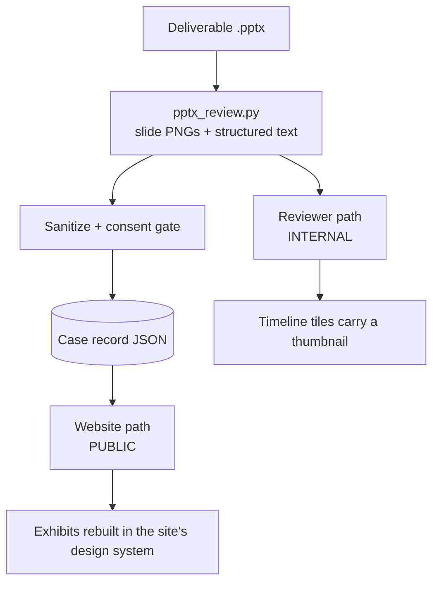

# Deliverable showcase

## The idea in one line
Render every deliverable's slides once, then feed them to two very different
consumers: the **reviewer's team-lead timeline**, where the full deck is already
in the model's hands and nothing needs hiding, and the **branch website**, where
the same work becomes a public case study and everything identifying must go.

## Why it matters

Two gaps close at once.

**The reviewer's timeline is currently abstract.** `timeline.tiles` is one tile
per slide carrying a `state` of pass, partial or critical, plus callouts and
contradiction connectors. A Team Lead reading "slide 12 contradicts slide 28"
has to go and open the deck to see it. Putting the slide itself in the tile makes
the contradiction connector something you can *look at* instead of something you
have to reconstruct — which is the difference between a report and a review.

**The website's case studies are an empty promise.** `index.html:199` currently
says our first case studies "are being prepared for publication with client
consent", with three reserved tiles beneath it. That is honest, and it is also
the single biggest hole in the site for a prospective client: a consultancy that
shows no work. Real deliverables are the only material that can fill it without
breaking the no-invented-content rule.

## How it might work

One extraction, two renderers. `tools/deck-transform/pptx_review.py` already does
the hard part — it exports each slide to a 1920×1080 PNG through PowerPoint COM
**and** pulls structured text per slide with python-pptx. Nothing new is needed to
get the raw material.



### Reviewer path — unblocked today

No sanitization, no consent, no waiting. The deck is already in the model's
context; a thumbnail of a slide the model has read reveals nothing new.

- Downscale each slide PNG to a ~320px WebP thumbnail keyed by slide number.
- The timeline tile already knows its `slide` number. The template resolves
  `slide N → thumbs/slide_N.webp` **by convention**. The model never emits an
  image path — that keeps principle 4 (deterministic contract: the model returns
  JSON, a static template owns every pixel) intact. A model that could name file
  paths could name one that does not exist.
- Hovering or opening a tile shows the slide; a connector between two tiles shows
  both slides side by side with the two quoted claims under them.
- **Thumbnails are real client material and must be gitignored like the rest of
  the real-deck intake.** Same rule as `eval-cases-real`.

### Website path — blocked on people, not on code

This is the part worth being careful about, and there are three separate gates
that are easy to collapse into one and should not be.

**Gate 1 — sanitization** removes identity. `SANITIZATION.md` and
`check-sanitized.js` already do this well, and the checklist transfers directly.

**Gate 2 — consent** is a different thing and is not satisfied by Gate 1. A
perfectly anonymised deck is still the client's work and their engagement. The
site already promises consent in writing, so we are held to it. Propose four
tiers, because clients will say yes to different amounts:

| Tier | What is published | Needs |
|---|---|---|
| 0 | nothing; the placeholder stays | — |
| 1 | sector + question + approach + banded outcome, no name, no logo | sanitization + light written OK |
| 2 | client named, logo shown | written consent naming the scope |
| 3 | named + a quote | consent + an approved quote |

Tier 1 is the one to aim at first: it unblocks the placeholder without needing
marketing sign-off from the client's side, and most of the value to a prospective
client is in the *shape* of the work, not the logo.

**Gate 3 — is a slide even the right artifact?** A deliverable answers the
client's question. A case study answers "should I hire this branch?" Those are
different documents. Slides are evidence *inside* a case study, not the case
study itself. Three to five exhibits beats twenty republished slides.

### The recommendation: rebuild the exhibits, do not redact the rasters

The tempting version is "export the slides, black out the sensitive bits, publish
the PNGs." That should be rejected, for four reasons:

1. **The existing gate cannot see a picture.** `check-sanitized.js` scans text.
   Point it at a PNG and it will return CLEAN while the slide still shows a
   client logo, a letterhead, a footer with the client's name, a chart axis with
   real figures, or a screenshot of their system. A text scanner over an image
   pipeline is a false negative generator, and a false CLEAN here is exactly the
   failure the sanitization gate exists to prevent. Redaction on a raster is also
   irreversible-looking but not irreversible — black boxes composited over text
   have leaked before.
2. **A dense 16:9 slide is unreadable on a phone.** V15 just learned this the
   hard way with hero photography: at 390px a 3:2 image is cropped to about its
   central quarter. A consulting slide at 390px wide is a grey smear. Rebuilt
   exhibits reflow.
3. **A raster is not accessible.** Rebuilt exhibits are real text — screen
   readable, selectable, searchable, translatable. A PNG of a slide is none of
   those, and the site would need a full alt-text transcription of each one
   anyway, which is most of the work of rebuilding it.
4. **Weight.** V15's image budget is already the tightest constraint on the site.
   A dense slide WebP runs 200–500 KB; five of them per case study is a page
   heavier than the entire hero pool.

Rebuilding means taking the sanitized *text and chart data* and laying it out in
the site's own design system as HTML and SVG. It is safe by construction — no
pixel of the original raster survives, so there is nothing to leak — it is
on-brand, and it is the "same high quality" the deliverables have, arguably
higher, because the house style is ours and consistent across cases.

The slide PNGs still matter: they are the **internal reference** the writer works
from, and they feed the reviewer path. They just never get uploaded.

### The case record

One JSON per case, following the pattern that already works for V15 photography —
a tracked provenance file plus a generator, so the public page cannot drift from
the record:

```json
{
  "id": "case-01",
  "tier": 1,
  "client": { "label": "A regional food bank", "sector": "Food security", "city": "Rotterdam" },
  "cycle": "Oct 2025 - Jan 2026",
  "team": { "consultants": 5, "teamLeader": true },
  "question": "the client's question, in their framing",
  "approach": ["..."],
  "exhibits": [{ "type": "framework|chart|table", "title": "...", "data": {} }],
  "outcome": { "claim": "...", "evidence": "client-confirmed | team-estimated | none" },
  "consent": { "grantedBy": "role, not name", "date": "", "scope": "", "record": "local path" }
}
```

`outcome.evidence` is deliberately explicit. An unverified impact number on a
public page is exactly the "invented outcomes" the honesty rules forbid, and
"the client told us this" and "we estimated this" must not look the same.

## Connects to
- Builds on: [[reviewer-v2]], `tools/deck-transform/pptx_review.py`,
  `tools/quality-reviewer/v2/SANITIZATION.md`
- Feeds into: `website/variants/` case-study placeholders,
  the reviewer's Team Lead Mode timeline

## Open question

**Which client do we ask first, and for which tier?** The website half is gated
on a human conversation with a real client, and that has weeks of lead time —
far longer than any of the code. Everything else here can be built while that
runs, but nothing can be published until one client says yes. Start that
conversation before writing a line of the website path.

Secondary: does the branch have written consent language already, or does that
need drafting and a look from someone who can speak to the client relationship?

## Notes

- The reviewer path and the website path should **not** share a sanitization
  step at runtime. The reviewer must never depend on sanitized input — it needs
  the real deck to review it — and wiring them together invites someone to
  "reuse" the reviewer's unsanitized thumbnails on the site.
- Sequencing, by what unblocks what:
  1. Start the client consent conversation (longest lead time, blocks everything public).
  2. Reviewer thumbnails in the timeline (no gate, immediate value, small).
  3. Case record schema + one real case taken end to end, to prove the pipeline.
  4. Website exhibit renderer + a `check-case-record.js` gate.
- A `check-case-record.js` should assert: consent record present and in date,
  tier declared, every figure either banded or covered by the consent scope, no
  email/URL/handle/person, and every outcome claim carrying an `evidence` value.
  Reuse `check-sanitized.js` for the text fields rather than reimplementing it.
- Open risk worth naming early: the first case study sets the template the branch
  will copy for years. Budget real design time for case 01 rather than treating
  it as content entry.
