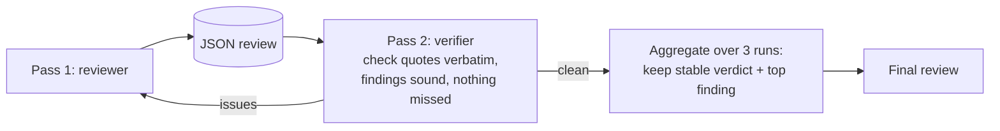

# Reviewer V2: verifier pass and self-consistency

## The idea in one line
Add a second model pass that checks the first reviewer's output before it ships, plus a three-run aggregate so the verdict is stable.

## Why it matters
The pilot showed a single pass can miss a real issue. On the licensing-strategy example, an independent reviewer caught an internal contradiction the first pass missed (the anchor figure stated two ways). A built-in verifier would catch that class of miss without a human in the loop, which is exactly the branch's quality job.

## How it might work

## Connects to
- Builds on: Quality Reviewer
- Feeds into: Golden-set calibration

## Open question
Does the verifier run as a separate prompt or as a second turn in the same project, and what does it cost per review.

## Notes
The pilot already proved the value by hand: an independent reviewer agent found the miss. V2 is about making that automatic and cheap.
