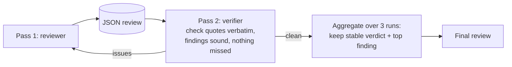

# Reviewer V2

## The idea in one line
Evolve the working single-pass reviewer into a serious human-controlled quality-assurance and learning system: a 10-dimension rubric, blocking-issue readiness (not an average), a strict noise budget, nine specialist lenses in one MVP call and an evaluation harness that makes quality measurable. The verifier pass and self-consistency below fold in as the staged multi-agent target.

## Design lives here
The full build plan and sprint documents are in [../../tools/quality-reviewer/v2/](../../tools/quality-reviewer/v2/). This card is the one-line pointer. Design phase, on branch `idea/reviewer-v2`. v1 stays untouched and shippable.

## Why it matters
The pilot showed a single pass can miss a real issue. On the licensing-strategy example, an independent reviewer caught an internal contradiction the first pass missed (the anchor figure stated two ways). A built-in verifier would catch that class of miss without a human in the loop, which is exactly the branch's quality job. v2 makes that catch automatic and, just as important, makes the whole review testable against expert judgment rather than asserted.

## How it might work

## Connects to
- Builds on: Quality Reviewer
- Feeds into: Golden-set calibration

## Open question
Does the verifier run as a separate prompt or as a second turn in the same project, and what does it cost per review.

## Notes
The pilot already proved the value by hand: an independent reviewer agent found the miss. V2 is about making that automatic and cheap.
