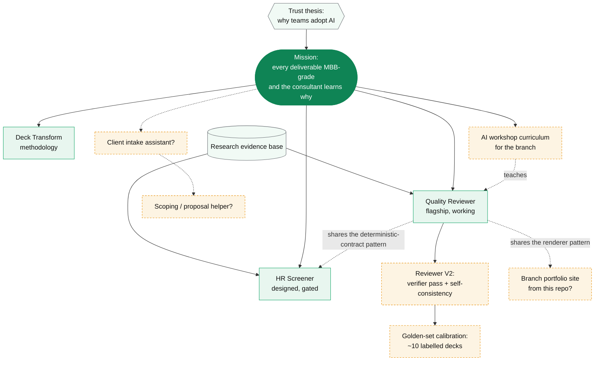

# Idea map

The shared brainstorming surface. Every box is an idea or a piece of work. Every arrow is a dependency or a feeds-into. Edit the graph as the thinking moves. This is meant to be messy and alive, not final.

Legend: solid nodes are shipped or built, dashed thinking is open. Colors group by theme.

## Reading the map

- **Built (green):** the three tools that exist today.
- **Foundation (grey):** the research base and the trust thesis that everything sits on.
- **Open (amber, dashed):** directions to brainstorm. These are spark or shaping stage, not commitments.

## Prompts for the next session

- Which open node has the highest leverage for the branch this term, not for us.
- What is missing from the map entirely. What problem is no one naming.
- Which built tool would benefit most from the next unit of effort.
- Where does the trust thesis change what we should build first.
