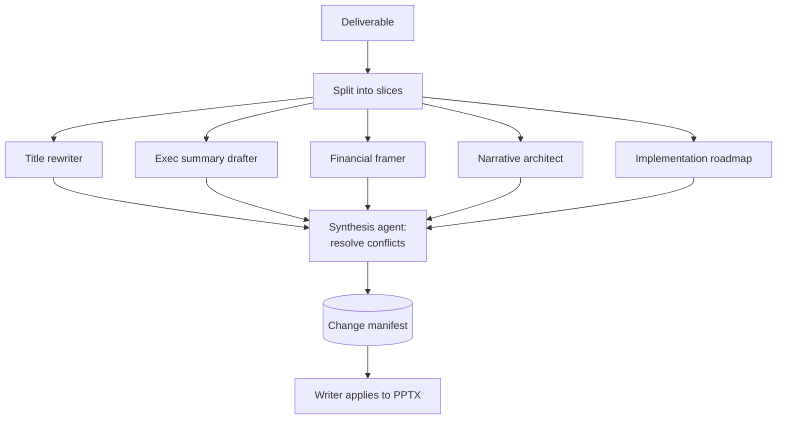

# Deck Transform

A fan-out / fan-in agent workflow that lifts a 180DC deliverable toward a McKinsey-tier deck without one model trying to hold the whole deck in context.

This folder documents the methodology. The original run-prompt was tied to a specific client deck and is not included. The reusable part is the pattern below and the [session notes](session-notes.md) from the build.

## The pattern

## Why fan-out

Each specialist agent sees only its relevant slice, not the full deck. That keeps context small, forces structured output, and means the synthesis step reads only the agents' compact outputs rather than the raw deck. The core insight: structure comes from forcing each agent to return JSON, and the synthesis only ever sees those JSONs.

## What is here

- [session-notes.md](session-notes.md): the build log, what worked, what the research changed.
- [pptx_review.py](pptx_review.py): a helper for inspecting and reviewing PPTX content.

## Relationship to the Quality Reviewer

Transform and review are opposite ends of the same belief: the reviewer diagnoses and teaches without rewriting, the transform rewrites toward a known standard. Keep them separate. The transform is a reference for what good looks like, not a consultant's deliverable. Never hand a transformed deck back as the team's own work.
