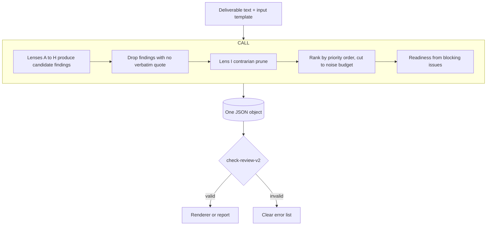
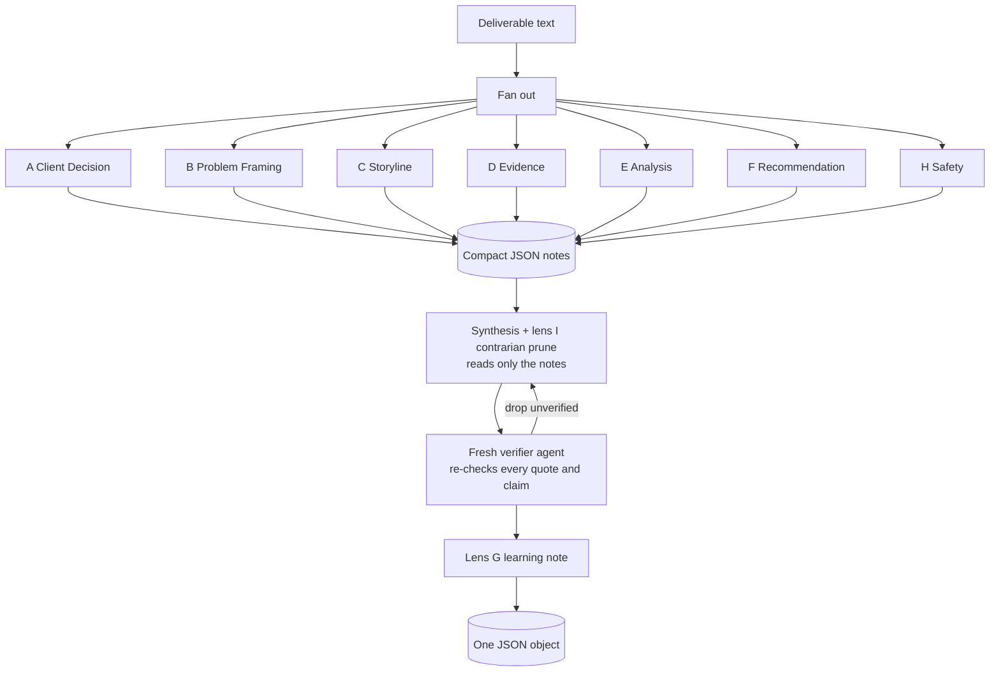

# 02. Agent architecture

Sprint 7 artifact. Design-ahead. This documents the target multi-agent architecture so
the MVP is built as a subset of it, not a thing to be thrown away. We do not build the
independent-agent orchestration in this design phase. The trigger to build it is in
section G.

Voice rules apply.

---

## A. Two architectures, one contract

Both the MVP and the target produce the same JSON object from
[03-output-contract.md](03-output-contract.md). What changes is how the nine lenses are
run and how their outputs are checked. The MVP runs them inside one call. The target
runs them as independent calls with a separate verifier. Because the contract is fixed,
we can move from one to the other without touching the renderer or the rubric.

## B. The MVP: one call, nine lenses inside



This rides the Claude Project at zero marginal cost. It is the version the branch runs
first. The lenses are sections of reasoning inside one prompt, described in
[04-prompt-templates.md](04-prompt-templates.md). The weakness is that the model checks
its own work, so a missed quote or an overconfident finding can slip through. That is
what the target architecture fixes.

## C. The target: independent lenses, a synthesis step and a fresh verifier



This mirrors patterns the branch has already designed: the fan-out or fan-in with each
agent returning compact JSON comes from deck-transform, and the separation of powers (a
verifier that is a different agent from the judge) plus the audit log come from
hr-screening.

## D. Per-agent output contract (target)

Each lens returns a small JSON note, never prose, so synthesis reads little and stays
cheap. Shape:

```
{
  "lens": "A",
  "candidateFindings": [
    {
      "claim": "the issue in one sentence",
      "dimension": 1,
      "severity": "critical | major | minor",
      "evidence": [ { "slide": 0, "quote": "verbatim" } ],
      "confidence": "low | medium | high"
    }
  ],
  "dimensionChecks": [ { "dimension": 1, "checksPassed": 0, "checksTotal": 4 } ],
  "abstained": [ "checks the lens could not judge from the text" ]
}
```

Synthesis reads the notes from A to H, not the deck. It merges, dedupes findings that
several lenses raise, prunes with lens I, ranks by the diagnostic priority order and
cuts to the noise budget.

## E. Synthesis protocol and disagreement handling

1. **Merge and dedupe.** The same issue raised by two lenses (for example D and F both
   flag the unsourced number) becomes one finding, keeping the strongest quote.
2. **Contrarian prune (lens I).** Cut low-value and generic candidates. If two lenses
   disagree on severity, take the lower unless the higher one carries a verbatim quote
   that clearly supports it.
3. **Rank and cut.** Priority order, then noise budget.
4. **Readiness.** From blocking issues only.
5. **Disagreement is logged, not hidden.** Where lenses genuinely conflict and the text
   does not settle it, the item becomes a question for the lead, not an asserted finding.
   This is the same instinct as turning a low-confidence check into a question.

## F. The verifier and the order-swap guard (target)

- **Verifier pass.** A fresh agent receives each surviving finding plus the deck and
  answers keep or drop, with the reason, by re-checking that the quote is a verbatim
  substring and that it actually supports the claim. This is the branch's proven fix for
  the class of miss a single pass makes (the licensing-strategy contradiction the pilot
  caught by hand). Anything the verifier cannot ground is dropped.
- **Order-swap guard.** For a finding that depends on comparing two slides (a
  contradiction, a duplicate), run the comparison both ways (slide X against slide Y, and
  Y against X). If the two runs disagree, downgrade to a question rather than assert it.
  Borrowed from the hr-screening pairwise design.
- **Self-consistency (optional).** Run the whole review two or three times at low
  temperature and keep the findings that recur. Divergent findings become questions. Use
  this only if the eval harness shows instability, since it multiplies cost.

## G. When to build the target (the trigger)

Stay on the MVP until one of these is true, then build the API or SDK orchestration:

1. **Volume.** Manual paste into a Claude Project becomes the bottleneck (roughly more
   than a handful of reviews a week, or multiple teams at once).
2. **Reliability.** The eval harness shows the single pass missing must-catch issues or
   failing the safety gate in a way a verifier would fix.
3. **Multi-user.** More than one reviewer needs the same tool with an audit trail.

Until then, the MVP plus honest use of the eval harness is enough, and it is far cheaper.
The cost ladder in [../BUILD-SPEC.md](../BUILD-SPEC.md) section 6 still holds: cache the
long system prompt, constrain the output to the JSON contract, keep output tokens small,
use the cheapest model that holds the rubric and escalate only regressions.

## H. Audit log (target)

When the tool runs automatically, every review writes an audit record: the model and
prompt version, the input hash (not the content), each lens note, the verifier keep or
drop decisions, the final findings and any human override. This is what makes an
automated review defensible and reproducible, and it is the same first-class audit
posture the hr-screening design takes.
